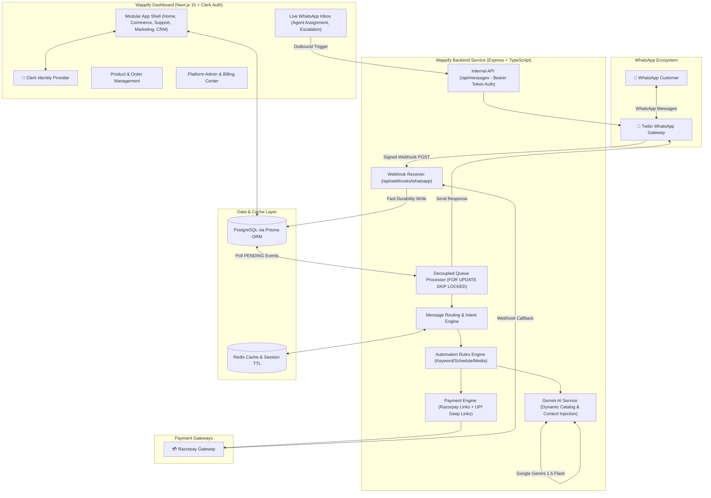
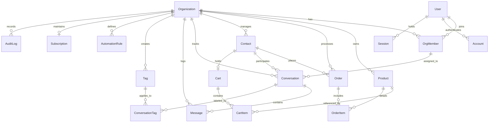

# 🏛️ Wappify — Codebase Structure, Architecture Deep Dive & Improvement Roadmap

> **Comprehensive Technical Blueprint & Codebase Analysis**  
> *Prepared for Wappify SaaS Platform*

---

## 1. 🌐 Executive Overview

**Wappify** is an AI-powered, multi-tenant WhatsApp Commerce and Business Operating System (SaaS). It enables D2C brands, retail stores, and service providers to automate WhatsApp customer interactions, showcase product catalogs, manage live customer chats, process multi-item shopping carts, execute payments (via Razorpay or direct zero-fee UPI deep links), and run rule-based automation with Google Gemini AI fallbacks.

The repository is structured as a decoupled two-tier architecture:
- **`wappify-backend`**: A high-throughput Node.js/Express TypeScript microservice that receives incoming webhooks, enqueues events into PostgreSQL, processes asynchronous conversational routing and AI generation, and dispatches WhatsApp messages via Twilio.
- **`wappify-dashboard`**: A modern Next.js 15 (App Router, React 19) merchant and administrative portal powered by Clerk Auth, Tailwind CSS, Radix UI / Shadcn, Framer Motion, and Recharts.

---

## 2. 🏗️ High-Level System Architecture



---

## 3. 📂 Detailed Directory Structure & Component Breakdown

### 📁 Root Directory Layout
```text
Wappify/
├── docs/                               # Architecture blueprints & operational runbooks
│   ├── production-launch-runbook.md    # Production checklist and environment requirements
│   ├── twilio-whatsapp-setup.md        # Twilio setup, sandbox, and webhook guide
│   └── wappify-platform-blueprint.md   # Multi-workspace & domain-driven OS blueprint
├── wappify-backend/                    # High-throughput asynchronous backend service
├── wappify-dashboard/                  # Next.js 15 Merchant & Admin Dashboard
├── .github/workflows/ci.yml            # CI/CD automated lint, test, and build pipelines
├── render.yaml                         # Infrastructure-as-code for Render deployment
└── README.md                           # Project documentation & quick start guide
```

---

### ⚙️ Backend Architecture (`/wappify-backend`)

The backend is built with **Node.js, Express, TypeScript, Prisma, Redis, and ioredis**.

```text
wappify-backend/src/
├── server.ts                           # Express bootstrap, security headers, rate limits, routes
├── config/
│   └── mockCatalog.ts                  # Fallback catalog definitions
├── controllers/
│   ├── messages.controller.ts          # Internal API controller for dashboard outbound messages
│   ├── razorpayWebhook.controller.ts   # Razorpay webhook with raw buffer HMAC validation
│   └── whatsappWebhook.controller.ts   # Twilio webhook receiver with signature validation
├── lib/
│   ├── businessHours.ts                # Schedule & timezone evaluation helper
│   ├── prisma.ts                       # Prisma Client singleton
│   ├── redis.ts                        # ioredis connection client
│   └── seed.ts                         # Development database seed utility
├── routes/
│   ├── messages.routes.ts              # /api/messages router
│   ├── razorpay.routes.ts              # /api/webhooks/razorpay router
│   └── whatsapp.routes.ts              # /api/webhooks/whatsapp router
└── services/
    ├── conversationStore.ts            # Conversation memory store for Gemini context
    ├── gemini.service.ts               # Google Gemini 1.5 Flash AI prompt orchestration
    ├── messageRouter.service.ts        # Intent parser, rule matching, catalog search & buy flow
    ├── order.service.ts                # Cart, Contact, and Order database operations
    ├── queueProcessor.service.ts       # Asynchronous WebhookEvent polling and worker loop
    ├── razorpay.service.ts             # Razorpay API client (Payment links creation)
    ├── twilioWhatsapp.service.ts       # Twilio SDK wrapper & phone number normalizer
    ├── upi.service.ts                  # Direct UPI deep-link generation
    └── whatsapp.service.ts             # Centralized WhatsApp messaging facade
```

#### Core Backend Execution Pipelines:
1. **Webhook Ingestion (< 20ms response time)**:
   - Twilio POSTs `x-www-form-urlencoded` payloads to `/api/webhooks/whatsapp`.
   - Payload is verified via `isValidTwilioWebhook` (`X-Twilio-Signature`).
   - The event is deduplicated (`externalEventId` / `MessageSid`) and persisted to the `WebhookEvent` table with status `PENDING`.
   - Returns immediate HTTP `200 OK` to prevent webhook timeouts.
2. **Asynchronous Processing (`queueProcessor.service.ts`)**:
   - Polling loop claims pending jobs using `SELECT ... FOR UPDATE SKIP LOCKED`.
   - Recovers stranded jobs if worker crashes.
   - Implements exponential backoff retry (up to 5 attempts) and automated 14-day log pruning.
3. **Merchant Resolution & Store Routing**:
   - Resolves merchant organization by explicit keyword prefix (`STORE-XXXX`), Redis route cache (`route:<wa_id>`), historical conversation records, or single-merchant fallback.
4. **Intelligent Dispatcher & Decision Tree (`messageRouter.service.ts`)**:
   - Logs incoming messages to DB for live inbox streaming.
   - Checks if conversation is escalated to human (`isEscalated: true` suppresses bot responses).
   - Evaluates custom `AutomationRule`s (Business Hours, First Message, Keywords, Media).
   - Dynamic Buy Flow: Matches product query against live database products, validates inventory, checks payment configuration (Razorpay vs UPI), and issues payment links.
   - AI Fallback: Passes context + history + active catalog to Gemini 1.5 Flash.

---

### 💻 Dashboard Architecture (`/wappify-dashboard`)

Built with **Next.js 15 App Router, React 19, Clerk Auth, Tailwind CSS, and Radix UI**.

```text
wappify-dashboard/
├── app/
│   ├── (auth)/                         # Public Clerk Auth pages (Login, Register)
│   ├── (dashboard)/                    # Authenticated workspace layout with Sidebar & Header
│   │   ├── dashboard/                  # Main home launcher & performance cards
│   │   ├── inbox/                      # Live WhatsApp chat inbox with real-time thread view
│   │   ├── commerce/ & products/       # Product catalog CMS, pricing, images, inventory
│   │   ├── orders/                     # Order history, fulfillment tracking, payment statuses
│   │   ├── contacts/ & crm/            # Customer directory, WhatsApp profiles, tags
│   │   ├── broadcast/ & marketing/     # Outbound WhatsApp campaigns
│   │   ├── automation/                 # Visual rule builder & triggers
│   │   ├── analytics/                  # Financial, token usage, and customer charts
│   │   ├── billing/                    # Merchant subscription tiers & payment history
│   │   ├── settings/                   # Brand details, store code, AI context, business hours
│   │   ├── admin/                      # Global platform administration & settings
│   │   └── [module]/[feature]/         # Dynamic module routing architecture
│   ├── api/                            # Internal Next.js REST API endpoints
│   │   ├── inbox/                      # Fetch & send messages, assign agents, toggle escalation
│   │   ├── products/, orders/          # CRUD operations for catalog & transactions
│   │   ├── automation/, tags/          # Rule management & conversation tagging
│   │   ├── broadcast/                  # Triggering backend outbound messaging
│   │   ├── billing/, webhooks/         # Razorpay subscription webhooks & management
│   │   └── admin/                      # Admin configuration endpoints
├── components/                         # UI Components (shadcn primitives, modals, tables, charts)
├── lib/
│   ├── auth-utils.ts                   # Clerk session claims parsing & DB Org synchronization
│   ├── prisma.ts                       # Prisma client instance
│   ├── razorpay-billing.ts             # SaaS subscription billing client
│   ├── templates.ts                    # Industry-specific onboarding templates
│   └── whatsapp.ts                     # Dashboard-to-backend communication client
├── modules/
│   └── platform/
│       └── module-config.ts            # Single source of truth for modular navigation OS
└── middleware.ts                       # Clerk route protection & public route matchers
```

---

## 4. 🗄️ Database & Domain Data Model

The PostgreSQL database is managed with Prisma ORM and shared between both services.



### Key Models:
- **`Organization`**: Multi-tenant merchant root storing store code, WhatsApp number, Razorpay API credentials, UPI ID, AI prompt customizations, and business hour schedules.
- **`OrgMember` & `User`**: RBAC model supporting roles (`OWNER`, `ADMIN`, `AGENT`).
- **`Contact` & `Conversation`**: WhatsApp customer profiles linked to unified conversation threads with escalation flags (`isEscalated`) and unread counters.
- **`Message`**: Unified chat message audit log tracking direction (`INBOUND` / `OUTBOUND`), delivery channels, and sender agent.
- **`Product`, `Cart`, `Order`**: Full e-commerce purchasing lifecycle from live catalog to checkout.
- **`WebhookEvent`**: Reliable outbox queue ensuring zero message loss and idempotency.
- **`AutomationRule`**: Configurable conditional automation rules evaluated on every incoming message.

---

## 5. 💡 How to Improve the Codebase (Actionable Roadmap)

Here is a structured, prioritised assessment of opportunities to elevate Wappify from an MVP to an enterprise-grade production platform.

---

### 🚀 Phase 1: High Priority (Code Health, Cleanup & Immediate Reliability)

#### 1. Clean Up Legacy & Duplicate Artifacts
- **Remove Duplicate Controllers**: Delete `wappify-backend/src/controllers/whatsappWebhook.controller 2.ts` and archive/remove unused `metaWhatsapp.service.ts` to eliminate ambiguity around Twilio vs. Meta API.
- **Remove Dead Code in Dashboard**: Remove `wappify-dashboard/lib/ai.ts` (which imports deprecated `gemini-pro`) since AI generation is already handled by the backend.
- **Consolidate Razorpay Webhooks**:
  - `wappify-backend/src/controllers/razorpayWebhook.controller.ts` handles customer order payments (`payment_link.paid`) and sends WhatsApp confirmations.
  - `wappify-dashboard/app/api/webhooks/razorpay-billing/route.ts` handles SaaS merchant subscription events.
  - `wappify-dashboard/app/api/webhook/razorpay/route.ts` is redundant and should be consolidated or removed.

#### 2. Move Conversation Memory from In-Memory Map to Redis
- **Problem**: `wappify-backend/src/services/conversationStore.ts` stores customer chat history in a local Node.js `Map` with an in-process `setInterval`. If the server restarts or scales to multiple instances on Render/Kubernetes, user conversation context is lost.
- **Solution**: Persist conversation history in Redis using `LPUSH` / `LTRIM` / `EXPIRE` or directly hydrate from the `Message` table in PostgreSQL.

#### 3. Real-Time Dashboard Updates (WebSockets / SSE)
- **Problem**: The Live Inbox (`wappify-dashboard/app/(dashboard)/inbox/page.tsx`) uses a 5-second `setInterval` polling interval to fetch new messages.
- **Solution**: Implement Server-Sent Events (SSE) or WebSockets (e.g., Pusher / Socket.io / Supabase Realtime) to stream incoming messages instantly to the merchant dashboard with zero latency.

---

### 🔒 Phase 2: Security & Multi-Tenant Data Protection

#### 1. Encrypt Sensitive Merchant Credentials at Rest
- **Current State**: `Organization.razorpayKeySecret` and `Organization.twilioAuthToken` are stored as plain text strings in PostgreSQL.
- **Improvement**: Implement envelope encryption (AES-256-GCM) with a platform master encryption key before persisting secrets to the database.

#### 2. Strict Input Validation with Zod
- Add [Zod](https://zod.dev/) schemas to validate request bodies across all backend routes and Next.js API endpoints (`/api/messages`, `/api/products`, `/api/broadcast`, etc.) to prevent invalid data formats and SQL/ORM injection edge cases.

#### 3. Granular Token Budgeting & Rate Limiting per Tenant
- Track token usage in Redis with sliding window limits per organization to prevent an individual customer or malicious bot from draining the platform's Gemini API budget.

---

### 🧠 Phase 3: AI & WhatsApp Commerce Experience

#### 1. Structured Function Calling & Tool Calling with Gemini
- **Current State**: Regex parsing (`STORE_CODE_REGEX`, `^buy (.+)$`) and substring matching are used to detect customer purchase intent.
- **Improvement**: Migrate Gemini to Gemini 1.5 / 2.0 with **Gemini Function Calling (Tools)**. Define explicit tools:
  ```typescript
  // Example tool definition
  {
    name: "search_catalog",
    description: "Search products in the store by name, category, or price",
    parameters: { ... }
  },
  {
    name: "add_to_cart_and_checkout",
    description: "Add items to cart and generate a payment link",
    parameters: { ... }
  }
  ```
  This makes conversational commerce natural and resilient to typos, language variations, and complex inquiries.

#### 2. Vector Search / RAG for Large Catalogs & FAQs
- For merchants with over 50 products, injecting the entire catalog into the Gemini system prompt increases token costs and latency.
- Implement pgvector in PostgreSQL to retrieve only the top 5 most relevant products based on customer semantic intent.

#### 3. WhatsApp Interactive Messages (Buttons & Lists)
- Upgrade plain text replies to interactive WhatsApp native messages (List Menus, Quick Reply Buttons, and Product Cards) where supported by Twilio WhatsApp Content API.

---

### 🏗️ Phase 4: Scalability & Monorepo Architecture

#### 1. Adopt Monorepo Architecture (Turborepo / Nx)
- **Current State**: `schema.prisma` is duplicated in both `wappify-backend/prisma/` and `wappify-dashboard/prisma/`. Any schema change must be manually kept in sync across both folders.
- **Improvement**: Transition to a Turborepo structure:
  ```text
  apps/
    ├── backend/
    └── dashboard/
  packages/
    ├── database/     # Single shared Prisma schema and client
    ├── types/        # Shared TypeScript interfaces and DTOs
    ├── ui/           # Shared UI component primitives
    └── config/       # Shared ESLint, TSConfig, and Tailwind configs
  ```

#### 2. Dedicated Background Job Worker (BullMQ + Redis)
- Replace database table polling (`setInterval` query with `SKIP LOCKED`) with [BullMQ](https://bullmq.io/) on Redis for instant webhook execution, job concurrency, priority queues, and dead-letter monitoring.

#### 3. Implement Full Workspace Entitlements Layer
- Follow the architectural design in `docs/wappify-platform-blueprint.md` to introduce first-class `Workspace` entities, module enable/disable switches, and fine-grained permissions (`marketing.campaign.publish`, `commerce.order.refund`, etc.).

---

## 6. 📊 Architecture Quality Scorecard

| Domain | Current State | Rating | Recommendation |
| :--- | :--- | :---: | :--- |
| **Decoupled Queue** | PostgreSQL `SKIP LOCKED` async processor | 🟢 Strong | Migrate to BullMQ + Redis for sub-second execution |
| **Auth & Tenancy** | Clerk Auth synced with Prisma Org models | 🟢 Strong | Transition to Workspace + RBAC capability map |
| **AI Integration** | Dynamic context injection into Gemini 1.5 Flash | 🟡 Good | Upgrade to Gemini Function Calling & pgvector RAG |
| **Payment Flow** | Razorpay Gateway + UPI Direct deep links | 🟢 Strong | Add automated refund handling & webhook idempotency |
| **Code Modularity** | Two separate repos with duplicate schemas | 🟡 Fair | Convert to Turborepo monorepo with `@wappify/db` |
| **Live Chat Inbox** | Polling with `setInterval` every 5s | 🟡 Fair | Upgrade to WebSockets / Server-Sent Events |
| **Secret Management**| Plain text keys in DB | 🔴 Needs Work | Add AES-256 field-level encryption for merchant keys |

---

## 7. 🏁 Summary

Wappify has a solid foundation with clean separation of concerns, an asynchronous queue outbox pattern that avoids WhatsApp timeouts, dynamic AI context generation, and multi-tenant e-commerce capabilities.

Following the roadmap above will prepare Wappify for rapid scale, enhanced security, lower operational latency, and a delightful merchant experience.
