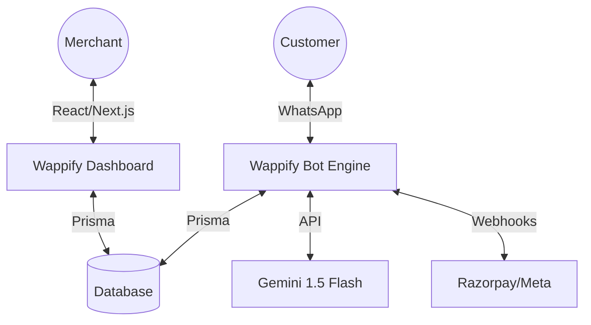

# 🚀 Wappify — AI-Powered WhatsApp Commerce SaaS

[](https://nextjs.org/)
[](https://nodejs.org/)
[](https://www.prisma.io/)
[](https://deepmind.google/technologies/gemini/)

Wappify is a premium, multi-tenant SaaS platform that enables D2C brands to sell directly on WhatsApp. It combines AI-driven customer engagement with a robust merchant dashboard to manage products, orders, and payments.

---

## ✨ Key Features

### 🛒 Smart WhatsApp Catalog
- **Live Sync**: Products added via the dashboard are instantly available to customers on WhatsApp.
- **Dynamic Retrieval**: Search and browse real products with current pricing and stock.
- **Automated Cart**: Customers can select items and quantity directly in chat.

### 🧠 AI Customer Concierge
- **Conversation Memory**: Remembers messages (up to 10 context turns) for a natural, persistent chat experience.
- **Dynamic Context**: Gemini 1.5 Flash is fed live business data and custom brand instructions for every interaction.
- **Multi-lingual Support**: Supports Hinglish, English, and local dialects by default.

### 📊 Merchant Control Center
- **Analytics Engine**: Real-time revenue charts (30D), top product stats, and customer metrics.
- **Order Flow Control**: Mark orders as **Shipped** or **Delivered** with automatic database updates.
- **Product CMS**: Add, Edit, or Soft-Delete products with support for images and inventory levels.

### 💳 Native Payments
- **Razorpay Integration**: Generates secure UPI and card payment links sent directly over WhatsApp.
- **Webhook Verified**: Bot acknowledges payment status once webhook confirmation is received.

---

## 🏗️ Architecture

Wappify is split into two primary components for optimal scalability:



### `/wappify-backend`
The core bot logic. Handles incoming messages, AI orchestration, catalog retrieval, and Meta API interactions.

### `/wappify-dashboard`
The merchant facing portal. Built with Next.js 15, specialized in order tracking, product management, and business intelligence.

---

## 🛠️ Tech Stack

- **Dashboard**: Next.js 15 (App Router), Tailwind CSS, Shadcn/UI, Lucide.
- **Backend Server**: Node.js & Express with TypeScript.
- **Database**: PostgreSQL / SQLite (managed via Prisma ORM).
- **AI Integration**: Google AI SDK (Gemini 1.5 Flash).
- **Payment Link**: Razorpay API.

---

## 🚀 Quick Setup

### Prerequisites
- Node.js 18+
- A [Meta Developer Account](https://developers.facebook.com/) (for WhatsApp API)
- A [Google AI Studio Key](https://aistudio.google.com/) (for Gemini)
- A [Razorpay Key & Secret](https://dashboard.razorpay.com/) (optional, for payments)

### 1. Installation
```bash
git clone https://github.com/GauharAlam/Wappify.git
cd Wappify

# Setup Backend
cd wappify-backend
npm install
cp .env.example .env # Fill in your keys (see below)
npx prisma db push
npm run build && npm run dev

# Setup Dashboard (New Terminal)
cd ../wappify-dashboard
npm install
cp .env.example .env # Fill in your keys (see below)
npx prisma db push
npm run dev
```

### 2. Required Environment Variables

| Variable | Source | Purpose |
| :--- | :--- | :--- |
| `MERCHANT_ID` | DB / Static | Default merchant UUID. |
| `GEMINI_API_KEY` | Google AI Studio | Powers the bot intelligence. |
| `WHATSAPP_PHONE_NUMBER_ID` | Meta Dashboard | Meta unique phone ID. |
| `WHATSAPP_ACCESS_TOKEN` | Meta Dashboard | Meta permanent access token. |
| `WHATSAPP_VERIFY_TOKEN` | Custom | Used to verify Meta webhooks. |
| `DATABASE_URL` | DB Host | Prisma connection string. |

---

## 🛡️ Security & Privacy
- **Masked Secrets**: Dashboard hides potentially sensitive API keys and only shows the last 4 characters for verification.
- **Soft Delete**: Product removal is non-destructive to preserve historical order integrity.
- **Isolated Memory**: Conversation history is stored in-memory per message session to ensure data privacy.

---

## 👨‍💻 Contributing
This is an MVP built for the Wappify SaaS ecosystem. Feel free to open issues or PRs for:
- [ ] Multi-image product carousels.
- [ ] Multi-merchant onboarding automation.
- [ ] Abandoned cart reminders.

---

## 📄 License
[MIT](LICENSE) © 2026 Gauhar Alam. 
Made with ❤️ by [Antigravity AI](https://github.com/GauharAlam).
