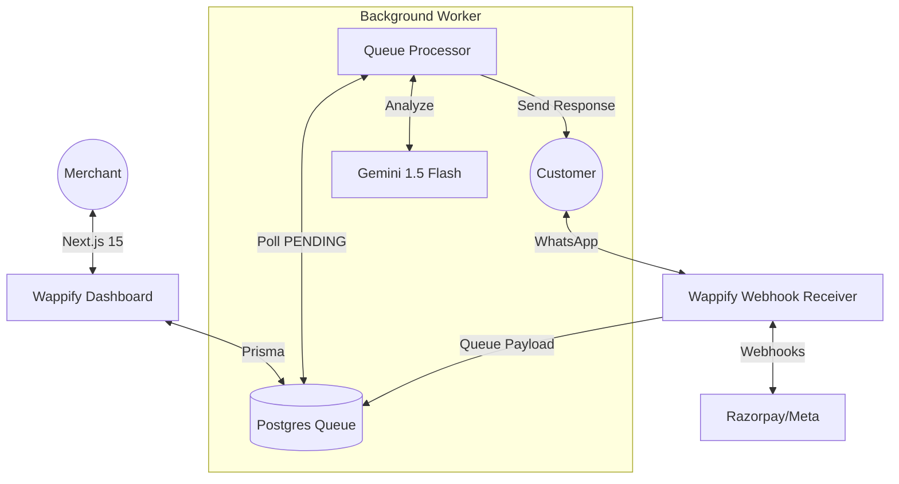

# 🚀 Wappify — AI-Powered WhatsApp Commerce SaaS

[](https://nextjs.org/)
[](https://nodejs.org/)
[](https://www.prisma.io/)
[](https://deepmind.google/technologies/gemini/)

Wappify is a premium, multi-tenant SaaS platform that enables D2C brands to sell directly on WhatsApp. It combines AI-driven customer engagement with a robust merchant dashboard to manage products, orders, and payments.

---

## ✨ Key Features

### 🛒 Smart WhatsApp Catalog
- **Live Sync**: Products added via the dashboard are instantly available to customers on WhatsApp.
- **Dynamic Retrieval**: Search and browse real products with current pricing and stock via Gemini AI.
- **Automated Cart**: Customers can select items and quantity directly in chat.

### 🧠 AI Customer Concierge
- **Conversation Memory**: Remembers messages (up to 10 context turns) for a natural, persistent chat experience.
- **Dynamic Context**: Gemini 1.5 Flash is fed live business data and custom brand instructions for every interaction.
- **Multi-lingual Support**: Supports Hinglish, English, and local dialects by default.

### 📊 Merchant Control Center
- **Analytics Engine**: Real-time revenue charts (30D), conversion metrics, and active engagement tracking.
- **Dynamic Header UI**: Integrated Notification center and User Profile menus for seamless navigation.
- **Product CMS**: Add, Edit, or Soft-Delete products with support for images and inventory levels.

### ⚡ Reliability at Scale
- **Postgres Webhook Queue**: Implemented an async outbox pattern. Webhooks are instantly acknowledged and queued in the DB, ensuring zero message loss during AI processing.
- **Rate Limiting Protection**: Built-in DDoS and bot protection (150 req/min) to safeguard your AI token budget.

---

## 🏗️ Architecture

Wappify is split into two primary components for optimal scalability, now featuring a decoupled background worker:



### `/wappify-backend`
The high-throughput engine. Features a webhook receiver that instantly acknowledges Meta API events, a Postgres-backed queue, and a background processor that handles AI orchestration and response dispatching.

### `/wappify-dashboard`
The merchant facing portal. Built with Next.js 15 (App Router), featuring a conversion-optimized landing page, secure onboarding, and real-time business intelligence.

---

## 🛠️ Tech Stack

- **Dashboard**: Next.js 15, Tailwind CSS, Shadcn/UI, Framer Motion, Lucide.
- **Backend Server**: Node.js & Express with TypeScript.
- **Database**: PostgreSQL (managed via Prisma ORM).
- **Core Engine**: Google Gemini AI, WhatsApp Cloud API, Razorpay Payments.

---

## 🚀 Quick Setup

### Prerequisites
- Node.js 18+
- A [Meta Developer Account](https://developers.facebook.com/)
- A [Google AI Studio Key](https://aistudio.google.com/)
- A [PostgreSQL Database](https://supabase.com/)

### 1. Installation
```bash
git clone https://github.com/GauharAlam/Wappify.git
cd Wappify

# Setup Backend
cd wappify-backend
npm install
cp .env.example .env
npx prisma generate
npx prisma db push
npm run dev

# Setup Dashboard (New Terminal)
cd ../wappify-dashboard
npm install
cp .env.example .env
npx prisma generate
npx prisma db push
npm run dev
```

---

## 🛡️ Security & Scalability
- **Decoupled Processing**: AI logic is separated from the request/response cycle, preventing WhatsApp webhook timeouts (200 OK sent in <20ms).
- **Resource Protection**: Express-rate-limit prevents malicious actors from draining your AI budget via webhook spam.
- **Type Safety**: Full-stack TypeScript with shared Prisma models ensures data integrity across the dashboard and backend.
- **CI/CD Pipeline**: Automated GitHub Actions workflows for linting, testing, and building the dashboard and backend to ensure code quality.

---

## 👨‍💻 Contributing
This is an MVP built for the Wappify SaaS ecosystem. Feel free to open issues or PRs for:
- [ ] Multi-merchant onboarding automation.
- [ ] Abandoned cart reminders.
- [x] Advanced analytics with Recharts.
- [x] Multi-item cart system.

---

## 📄 License
[MIT](LICENSE) © 2026 Gauhar Alam. 
